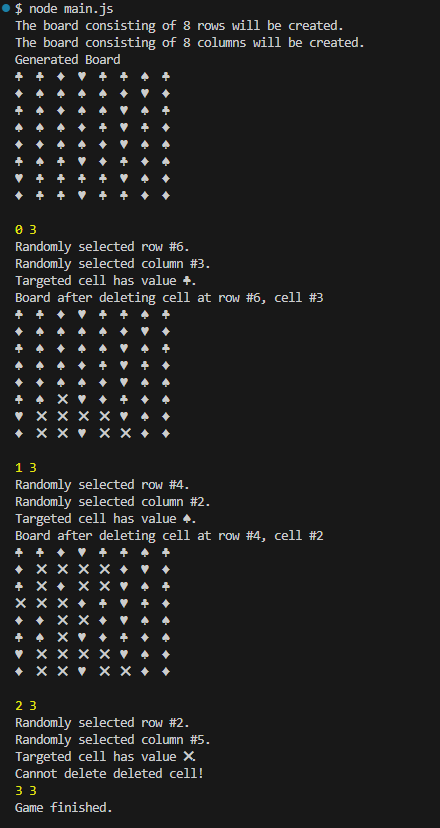

<h1>PlayToMax Test Task</h1>
        <h3>by Nadiia Yanushevska</h3>
        <h2>Contents</h2>
        <ul>
            <li><a href="#about">About</a></li>
            <li><a href="#terminal">Terminal Run</a></li>
            <li><a href="#interactive">User Interactive Mode</a></li>
            <li><a href="#tech">Tech Stack</a></li>
        </ul>
        <h2 id="about">About</h2>
        

            This game generates board with cells, each containing one of the
            symbols: ♠, ♥, ♣, ♦. When user clicks on a cell, it deletes the cell
            as well as any of its neighbors with the same value.
        

        

            There are two modes to play the game: using terminal with default
            and random values and user interactive, where you can choose the
            values.
        

        <h2 id="terminal">Terminal Run</h2>
        

<code>&#9888; Requires Node.js LTS version</code>

To run demo mode, copy repository, open terminal in the root folder and enter the following command:

            
<code>node main.js</code>

        

            This mode uses default board size of 8x8 cells, and runs 3 round of
            the game. Each round generates random values for row and column
            to imitate user cell selection. Then the selected cell is clicked
            and the cell(s) is/are deleted. At the end of the round, the updated
            table is displayed.
        

        <h3>Preview:</h3>
        

<h2 id="interactive">User Interactive Mode</h2>
        
To run user interactive mode, navigate to live page.

        
<code>&#128712; This is light version of the game and does not provide visualizations yet. Use <strong>Dev Tools</strong> to see logs.</code>

        

            Once the page loads you will see prompts, which will ask to input
            number of rows and number of columns for the table. After that, you
            will be asked if you want to continue playing. If you choose to
            continue, you will be asked to select row and column of the cell
            coordinates to click. Otherwise, the game is finished.
        

<h2 id="tech">Tech Stack</h2>
        <ul>
            <li>Javascript</li>
            <li>OOP</li>
        </ul>
